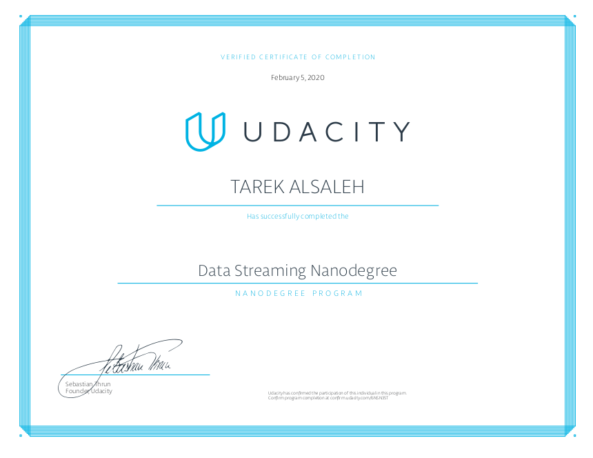

# Udacity-Data-Streaming-Nanodegree
This repo contains details of the following projects completed as part of Udacity's data streaming nanodegree:
1. [Optimizing Chicago Public transport with Apache Kafka](https://github.com/tarekalsaleh/Udacity-Data-Streaming-Nanodegree/tree/master/Chicago_Public_Transport_Optimization)
2. Analyzing San Francisco Crime Statistics with Apache Spark Structured Streaming

